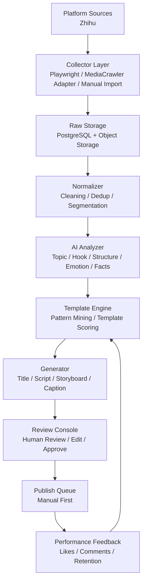
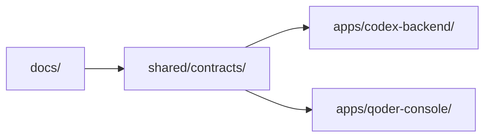

# 技术架构图

## 1. 架构原则

1. 先做离线研究和人工审核，不急于全自动。
2. 采集、分析、模板、生成四层解耦。
3. 平台能力插件化，防止某个平台失效拖垮全局。
4. AI 调用过程可追踪、可重跑、可缓存。
5. 让你能边学边改，尽量避免一开始就上复杂微服务。
6. 第一阶段严格以知乎单平台和手动触发任务为主。

## 2. 总体架构

> 详细模块职责与分层说明请参见 [06-architecture-design.md](./06-architecture-design.md) 第 3-4 章。

## 3. 分层设计

### 3.1 采集层

职责：

1. 对接平台采集器。
2. 第一阶段以手动触发方式采集热门内容、搜索结果、话题页、作者页。
3. 存储原始数据和采集日志。

建议实现：

1. 优先复用 `MediaCrawler` 的平台能力。
2. 对不适配的部分封装为内部 adapter。
3. 第一阶段只实现知乎模块，其他平台只保留接口扩展点。

### 3.2 规范化层

职责：

1. 清洗 HTML、Markdown、表情、特殊符号。
2. 抽取正文、标题、标签、互动指标。
3. 去重和相似内容归并。

### 3.3 AI 分析层

职责：

1. 识别内容主题与赛道。
2. 抽取开头钩子、冲突、叙事结构、情绪驱动。
3. 提取适合视频化的表达。
4. 生成结构化特征和摘要。

### 3.4 模板层

职责：

1. 聚合同结构高表现内容。
2. 归纳标题模板和脚本模板。
3. 根据表现数据对模板评分。

### 3.5 生成层

职责：

1. 结合主题、模板、资料生成新内容。
2. 输出标题、脚本、分镜、封面文案、发布文案。
3. 标记引用来源与事实风险点。

### 3.6 审核层

职责：

1. 人工查看生成内容。
2. 对比 AI 初稿、编辑稿和定稿。
3. 完成事实风险人工确认。
4. 决定是否进入发布。

## 4. 技术选型建议

### 后端

1. Python 3.11+
2. FastAPI
3. Pydantic
4. SQLAlchemy
5. 手动触发为主，`APScheduler` 仅作为可选能力

### 采集

1. MediaCrawler
2. Playwright
3. requests/httpx

### 数据

1. PostgreSQL
2. Redis 可选
3. 本地开发可先用 SQLite

### AI

1. OpenAI-compatible API
2. Prompt templates + structured output
3. Langfuse 或自建日志表做调用追踪

### 前端或控制台

1. 先做轻量 Web Console
2. Qoder 负责简单页面和审核视图更合适

## 5. 双工作区协作架构

由于 `Codex` 与 `Qoder` 不能在同一目录开发，建议这样拆：

说明：

1. `docs/` 放产品、架构、数据库、提示词设计。
2. `shared/contracts/` 放 API 契约、字段约定、JSON Schema、示例数据。
3. `apps/codex-backend/` 只放 Python 后端与任务流程。
4. `apps/qoder-console/` 只放前端、控制台、审核工具。

这样你可以：

1. 在 PyCharm 中主看 `apps/codex-backend`
2. 让 Codex 主做后端逻辑
3. 让 Qoder 在 `apps/qoder-console` 单独开发

## 6. 推荐接口流

### 内容采集流

`平台配置 -> 采集任务 -> 原始内容入库 -> 规范化 -> 去重`

### 模板生成流

`筛选高表现内容 -> AI 标签化 -> 聚类归纳 -> 模板生成 -> 人工确认`

### 内容生成流

`输入主题 -> 检索历史样本/模板 -> AI 生成草稿 -> 人工审核 -> 发布`
