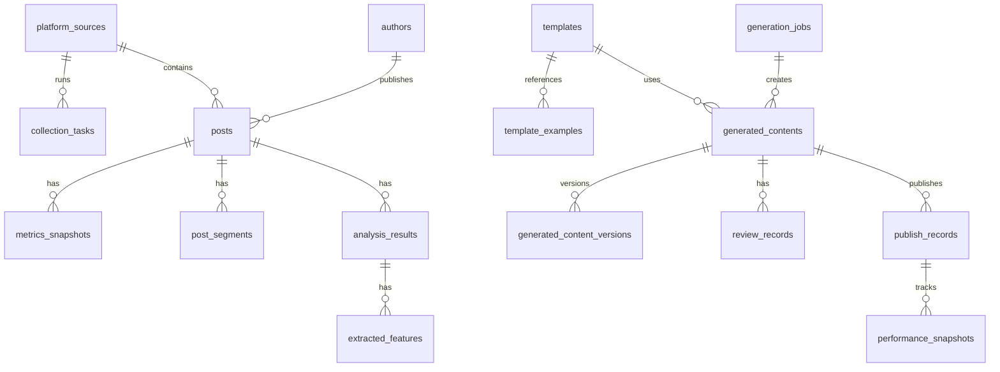

# 数据库设计

## 1. 设计目标

数据库需要支持四类核心对象：

1. 平台原始内容
2. 任务执行与审计记录
3. AI 分析与模板资产
4. 新生成内容及其审核与发布记录

第一阶段优先“够用、清晰、可追溯”，不追求极致范式。
当前交付范围严格限定为“知乎单平台 MVP + 人工审核闭环”。

## 2. 核心实体关系

## 3. 表设计

### 3.1 `platform_sources`

平台定义表。

字段建议：

1. `id`
2. `code`：第一阶段固定 `zhihu`
3. `name`
4. `enabled`
5. `mvp_enabled`
6. `collector_type`
7. `created_at`

### 3.2 `authors`

作者信息表。

字段建议：

1. `id`
2. `platform_id`
3. `platform_author_id`
4. `name`
5. `profile_url`
6. `follower_count`
7. `bio`
8. `raw_json`
9. `created_at`
10. `updated_at`

### 3.3 `posts`

原始内容主表。

字段建议：

1. `id`
2. `platform_id`
3. `author_id`
4. `platform_post_id`
5. `source_type`
6. `post_type`
7. `url`
8. `title`
9. `summary`
10. `content_text`
11. `content_markdown`
12. `language`
13. `topic_keywords`
14. `published_at`
15. `like_count`
16. `comment_count`
17. `favorite_count`
18. `share_count`
19. `view_count`
20. `engagement_score`
21. `is_hot`
22. `is_historical_hot`
23. `status`
24. `note`
25. `raw_json`
26. `created_at`
27. `updated_at`

说明：

1. 知乎问答、文章、想法都可落在 `posts`。
2. 纯文字内容依旧保留视频化潜力标签。
3. `source_type` 区分自动采集与手动录入，建议值为 `collector` / `manual_import`。

### 3.4 `metrics_snapshots`

互动指标快照表，用于观察内容热度变化。

字段建议：

1. `id`
2. `post_id`
3. `like_count`
4. `comment_count`
5. `favorite_count`
6. `share_count`
7. `view_count`
8. `captured_at`

### 3.5 `post_segments`

内容分段表，用于存正文段落、回答片段、视频转写片段。

字段建议：

1. `id`
2. `post_id`
3. `segment_index`
4. `segment_type`
5. `text`
6. `token_count`
7. `created_at`

### 3.6 `analysis_results`

AI 分析主表。

字段建议：

1. `id`
2. `post_id`
3. `analysis_version`
4. `model_name`
5. `prompt_version`
6. `summary`
7. `main_topic`
8. `content_angle`
9. `hook_text`
10. `narrative_structure`
11. `emotional_driver`
12. `video_adaptability_score`
13. `fact_risk_level`
14. `fact_risk_items`
15. `fact_check_status`
16. `fact_check_reviewer`
17. `fact_check_notes`
18. `reasoning_json`
19. `created_at`

说明：

1. `fact_check_status` 表示人工事实确认状态。

### 3.7 `extracted_features`

结构化特征表。

字段建议：

1. `id`
2. `analysis_id`
3. `feature_type`
4. `feature_key`
5. `feature_value`
6. `score`
7. `created_at`

例子：

1. `feature_type = hook`
2. `feature_key = opening_pattern`
3. `feature_value = 反常识提问`

### 3.8 `templates`

模板主表。

字段建议：

1. `id`
2. `template_type`
3. `template_category`
4. `name`
5. `applicable_platform`
6. `applicable_topic`
7. `applicable_scene`
8. `structure_json`
9. `prompt_template`
10. `quality_score`
11. `source_post_count`
12. `status`
13. `version`
14. `created_at`
15. `updated_at`

模板类型可包括：

1. `title`
2. `script`
3. `storyboard`
4. `caption`

模板颗粒度分类建议：

1. `title_hook`
2. `opening_hook`
3. `narrative_frame`
4. `ending_cta`
5. `full_script`

### 3.9 `template_examples`

模板示例映射表。

字段建议：

1. `id`
2. `template_id`
3. `post_id`
4. `relevance_score`
5. `created_at`

### 3.10 `generation_jobs`

生成任务表。

字段建议：

1. `id`
2. `job_type`
3. `input_topic`
4. `input_brief`
5. `input_sources_json`
6. `selected_template_id`
7. `prompt_version`
8. `model_name`
9. `status`
10. `error_message`
11. `created_at`
12. `updated_at`

### 3.11 `generated_contents`

生成结果表。

字段建议：

1. `id`
2. `job_id`
3. `template_id`
4. `title`
5. `script_text`
6. `storyboard_json`
7. `cover_text`
8. `publish_caption`
9. `hashtags`
10. `fact_check_status`
11. `fact_check_notes`
12. `source_trace_json`
13. `current_version_no`
14. `status`
15. `created_at`
16. `updated_at`

### 3.12 `review_records`

人工审核表。

字段建议：

1. `id`
2. `generated_content_id`
3. `reviewer`
4. `decision`
5. `comment`
6. `fact_check_status`
7. `selected_version_no`
8. `reviewed_at`

### 3.13 `generated_content_versions`

生成内容版本表，用于支撑审核对比视图和版本留存。

字段建议：

1. `id`
2. `generated_content_id`
3. `version_no`
4. `title`
5. `script_text`
6. `storyboard_json`
7. `cover_text`
8. `publish_caption`
9. `edit_note`
10. `editor`
11. `created_at`

### 3.14 `collection_tasks`

采集任务表。

字段建议：

1. `id`
2. `platform_id`
3. `task_type`
4. `query_keyword`
5. `date_range_start`
6. `date_range_end`
7. `trigger_mode`
8. `status`
9. `success_count`
10. `failed_count`
11. `raw_output_path`
12. `started_at`
13. `finished_at`
14. `error_message`
15. `created_at`
16. `updated_at`

说明：

1. 用于支撑任务中心和调度器。
2. 建议状态与架构文档中的 `collector_task.status` 保持一致。
3. 第一阶段默认 `trigger_mode = manual`。

### 3.15 `publish_records`

发布记录表。

字段建议：

1. `id`
2. `generated_content_id`
3. `platform_code`
4. `publish_channel`
5. `published_url`
6. `published_at`
7. `operator`
8. `status`
9. `notes`
10. `created_at`
11. `updated_at`

### 3.16 `performance_snapshots`

发布效果快照表。

字段建议：

1. `id`
2. `publish_record_id`
3. `like_count`
4. `comment_count`
5. `favorite_count`
6. `share_count`
7. `view_count`
8. `retention_rate`
9. `captured_at`
10. `created_at`

### 3.17 `prompt_specs`

Prompt 版本登记表。

字段建议：

1. `id`
2. `biz_type`
3. `prompt_name`
4. `prompt_version`
5. `output_schema_name`
6. `status`
7. `created_at`
8. `updated_at`

### 3.18 `model_invocation_logs`

模型调用审计表。

字段建议：

1. `id`
2. `biz_type`
3. `biz_id`
4. `model_name`
5. `prompt_version`
6. `request_tokens`
7. `response_tokens`
8. `latency_ms`
9. `status`
10. `error_message`
11. `created_at`

说明：

1. `biz_type` 可取 `analysis`、`template`、`generation`。
2. 第一阶段不要求优先落地，可在需要成本审计时补充。

## 4. 第一阶段最小表集合

如果你想尽快跑起来，第一阶段最小可只建这些表：

1. `platform_sources`
2. `collection_tasks`
3. `authors`
4. `posts`
5. `analysis_results`
6. `templates`
7. `generation_jobs`
8. `generated_contents`
9. `generated_content_versions`
10. `review_records`

如果要把“发布复盘”一起纳入第一阶段，则再补：

1. `publish_records`
2. `performance_snapshots`
3. `prompt_specs`

如果要补充调用成本审计，再增加：

1. `model_invocation_logs`

## 5. SQLite 到 PostgreSQL 的迁移建议

第一阶段可以先用 SQLite，原因：

1. 上手快
2. 便于你学习和调试
3. 本地单机足够

等进入第二阶段再切 PostgreSQL。
