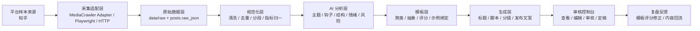

# 技术方案

## 1. 文档目标

本文档基于现有 `PRD`、高层架构、数据库草稿和目录规划，输出第一阶段可执行的技术方案，用于统一以下问题：

1. 第一阶段做什么、不做什么。
2. 哪些技术选型最适合“个人开发 + AI 协作 + 渐进式扩展”。
3. 如何把“历史爆款采集 -> 内容理解 -> 结构抽象 -> 模板沉淀 -> 新内容生成 -> 人审发布 -> 数据复盘”落成可运行系统。
4. 为后续接口文档、数据字典、任务拆解提供统一依据。

## 2. 可行性结论

### 2.1 业务可行性

项目具备明确业务价值，尤其适合“历史内容赛道 + 短视频脚本生产”这一垂直方向，原因如下：

1. 历史类内容天然适合做结构拆解，主题集中、素材边界相对清晰。
2. 知乎、小红书、B 站都能为“观点、叙事、表达方式”提供高质量样本。
3. 你的目标不是直接洗稿，而是抽取结构模板再生成新内容，这条路径更稳，也更适合长期积累内容资产。

### 2.2 工程可行性

第一阶段完全可做，但前提是控制范围：

1. 先做离线采集、离线分析、人工审核，不做全自动发布。
2. 第一阶段开发只落地 `知乎` 一个采集源，`小红书 / B站` 仅保留接口扩展位，不进入当前迭代交付。
3. 先做“脚本生产系统”，不做“自动剪辑成片系统”。
4. 先做单体应用 + 单平台适配器，不上微服务，不引入复杂任务队列。

### 2.3 主要风险与对策

| 风险 | 表现 | 对策 |
| --- | --- | --- |
| 平台反爬和策略变化 | 采集不稳定、字段变动、账号受限 | 第一阶段只做知乎；优先复用 `MediaCrawler`；保留手工导入和本地文件回填能力 |
| AI 幻觉和事实错误 | 生成的历史内容不准确 | 加入事实风险字段、事实人工复核流程、来源追踪和审核拦截 |
| 模板失真 | 模板抽得太空、无法复用 | 模板必须绑定示例样本、模板颗粒度分类、适用场景和质量评分 |
| 数据链路不可追溯 | 后续无法判断生成内容源于哪些样本 | 每次分析、模板、生成都记录版本号、来源映射和审核版本 |
| 项目过早复杂化 | 一上来引入太多队列、中间件和自动化 | 第一阶段先单体架构，默认手动触发任务，不落地复杂调度系统 |

## 3. 建设范围

### 3.1 第一阶段范围

1. 采集知乎热门和历史高赞内容。
2. 清洗文本并沉淀可分析样本。
3. 用 AI 抽取主题、钩子、结构、情绪、事实风险等特征。
4. 归纳标题模板、脚本模板、开头模板和结尾模板。
5. 基于主题 + 模板 + 资料生成新脚本。
6. 在控制台中完成人工审核、编辑、事实确认、定稿和结果归档。
7. 支持手动录入样本和发布后数据回填。

### 3.2 第一阶段不做

1. 自动发布到平台。
2. 自动剪辑视频成片。
3. 复杂权限系统。
4. 多租户和商业化计费。
5. 强实时推荐和在线推理编排。
6. 多平台并发采集和复杂调度中心。

## 4. 建设原则

1. 先能跑通研究闭环，再追求自动化闭环。
2. 数据先留全，再逐步做高质量结构化。
3. 平台能力插件化，业务流程标准化。
4. 所有 AI 结果必须可追踪、可重跑、可人工覆盖。
5. 所有生成内容默认进入人审，不直接发布。

## 5. 总体方案概览

## 6. 推荐技术选型

| 层级 | 选型 | 说明 |
| --- | --- | --- |
| 后端语言 | Python 3.11+ | 适合采集、数据处理、AI 编排，且便于你用 PyCharm 主开发 |
| API 框架 | FastAPI | 适合快速搭接口、自动生成 OpenAPI，后续写接口文档也方便 |
| 数据模型 | Pydantic v2 | 用于请求响应、AI 结构化输出、配置校验 |
| ORM / 迁移 | SQLAlchemy 2 + Alembic | 支撑从 SQLite 平滑迁移到 PostgreSQL |
| 调度 | 手动触发 + 可选 APScheduler | 第一阶段默认手动执行任务；只有需要定时补采时才启用轻调度 |
| 采集 | MediaCrawler + Playwright + httpx | MediaCrawler 做主力，Playwright 处理登录态和动态页面，httpx 做轻请求 |
| 数据库 | 开发期 SQLite，后续 PostgreSQL | 满足先本地跑通，再逐步走向稳定存储 |
| 缓存 | 第一阶段可不强依赖；预留 Redis | 只在任务队列、缓存和限流需要时引入 |
| 文件存储 | 本地文件系统，后续可换 MinIO / OSS | 与 `data/raw`、`data/processed`、`data/exports` 保持一致 |
| AI 接口 | OpenAI-compatible API | 统一兼容模型层，避免后续更换服务商时大改 |
| Prompt 管理 | `shared/contracts/prompts` + 版本号 | 所有分析和生成 Prompt 都必须版本化 |
| 控制台 | React + TypeScript + Vite | 轻量、开发快，适合 Qoder 单独维护页面 |
| UI 组件 | 成熟后台组件库 | 第一阶段以效率优先，不自建设计系统 |

## 7. 核心业务流程设计

### 7.1 样本采集流程

1. 用户配置平台、关键词、时间范围、采集模式。
2. 系统创建采集任务并调用平台适配器。
3. 适配器采集原始内容、作者信息、互动数据、原始响应体。
4. 系统做去重、字段映射和正文提取。
5. 规范化后的内容写入 `posts` 等核心表，原始文件保存在 `data/raw`。

### 7.2 内容理解流程

1. 系统从样本库中选取待分析内容。
2. 先做文本清洗、分段、长度裁剪和特征预处理。
3. 调用 AI 输出结构化结果，包括主题、钩子、冲突、叙事结构、情绪、事实风险。
4. 结果写入分析表，同时记录模型名、Prompt 版本和原始响应。

### 7.3 模板沉淀流程

1. 根据赛道、主题、结构特征筛选高表现样本。
2. 对样本做聚类或规则聚合。
3. 生成可复用模板，并绑定来源示例、模板分类和适用场景。
4. 通过人工筛选把模板状态从草稿切到可用。

**模板创建三种路径**：

1. **手动创建**：用户直接在前端填写模板结构。
2. **AI 生成**：用户输入生成目标，可选传入参考样本 ID，后端查询样本 + 分析特征注入 Prompt。
3. **自动归纳**：选择一批分析结果，后端按 main_topic + emotional_driver 聚类，自动生成模板结构。

### 7.4 新内容生成流程

1. 用户输入主题、人物、问题、参考资料。
2. **用户在前端选择参考样本（已分析的 Post）和可用模板**。
3. 系统检索相关模板和历史样本。
4. **后端自动查询参考样本的分析特征（main_topic、hook_text、narrative_structure、emotional_driver）并注入生成 Prompt**。
5. AI 输出标题候选、口播脚本、分镜建议、封面文案、发布文案。
6. 系统标记模板来源、样本来源和事实风险提示。
7. 审核阶段必须支持原始样本、生成草稿、人工修改稿的对比查看。
8. 事实风险项需要人工标记“已确认 / 存疑 / 需补证据”。
9. 审核通过后进入“待发布”状态，由人工手动发布。

### 7.5 数据复盘流程

1. 发布后回填点赞、收藏、评论、完播等指标。
2. 将表现数据挂回模板和生成记录。
3. 用于判断哪些模板、哪些结构、哪些开头最有效。

### 7.6 手动样本录入流程

1. 用户在控制台输入来源链接、标题、正文、发布时间、标签和备注。
2. 系统将其标记为 `manual_import` 来源，绕过自动采集器。
3. 手动录入样本与采集样本共用同一分析、模板和生成链路。

## 8. 数据与资产管理策略

### 8.1 数据分层

| 层级 | 内容 | 存储建议 |
| --- | --- | --- |
| Raw | 平台原始响应、页面快照、采集日志 | `data/raw` + 原始 JSON 字段 |
| Normalized | 标题、正文、标签、指标、发布时间等标准字段 | 数据库核心表 |
| Analysis | 结构特征、风险、摘要、Prompt 输出 | 数据库分析表 + `data/processed` |
| Template | 模板定义、评分、示例绑定 | 数据库模板表 |
| Generated | 标题、脚本、分镜、审核记录 | 数据库生成表 |
| Export | CSV、Markdown 报告、研究摘要 | `data/exports` |

### 8.2 版本化要求

以下内容必须记录版本号：

1. 采集器版本
2. 字段映射版本
3. Prompt 版本
4. 模型版本
5. 模板版本
6. 生成内容版本

### 8.3 可追溯要求

每条生成内容至少能回答以下问题：

1. 用了哪个模板？
2. 参考了哪些历史样本？
3. 使用了哪个模型和 Prompt 版本？
4. 是否被人工修改过？
5. 事实风险由谁确认过？

## 9. 非功能要求

### 9.1 可维护性

1. 平台采集器必须按目录拆分。
2. Prompt 与 JSON Schema 不写死在业务代码里。
3. 每个核心流程都支持单独重跑。
4. 手动录入、审核、回填都要能独立操作，不依赖自动化任务。

### 9.2 可观测性

1. 所有任务必须有 `task_id` 或 `trace_id`。
2. 采集失败、AI 调用失败、字段映射失败都需要单独记录。
3. 后续控制台要能查到任务状态和失败原因。
4. 审核和事实确认操作要保留操作者和时间戳。

### 9.3 安全与合规

1. 默认不做自动发布。
2. 默认保留原始来源链接。
3. 生成结果必须标记“结构参考而非内容复制”。
4. 历史内容必须保留事实风险说明。
5. 所有存在事实风险的内容，未完成人工确认前不得标记为可发布。

## 10. 第一阶段最小执行计划

### 阶段 0：工程初始化

目标：搭出后续开发不会返工的骨架。

1. 初始化 `FastAPI + SQLAlchemy + Alembic`。
2. 建立 `shared/contracts/api`、`schemas`、`prompts` 目录规范。
3. 补齐基础配置、日志、环境变量、数据目录约定。
4. 补齐 Prompt 命名规则、版本规则和极简启动说明。

### 阶段 1：采集 MVP

目标：只打通知乎的历史高赞样本入库。

1. 接入 `MediaCrawler` 或封装首个平台适配器。
2. 实现手动触发采集、失败重试、原始文件留存。
3. 入库 `platform_sources`、`authors`、`posts`、`collection_tasks`。
4. 提供手动样本录入接口作为补充入口。

### 阶段 2：理解 MVP

目标：让样本从“原始内容”变成“可分析资产”。

1. 实现文本清洗、分段、去重。
2. 实现 AI 分析链路和结构化输出。
3. 入库 `analysis_results` 和结构特征。
4. 支持事实风险人工标记和补充备注。

### 阶段 3：模板 MVP

目标：沉淀第一批可复用模板。

1. 实现按主题和结构筛选样本。
2. 实现模板生成、模板评分、模板示例绑定。
3. 为模板增加颗粒度分类，如 `title_hook`、`opening_hook`、`narrative_frame`、`ending_cta`。
4. 建立模板审核和启用机制。

### 阶段 4：生成 MVP

目标：从主题输入直接得到一版可审核脚本。

1. 实现主题输入、模板检索、脚本生成。
2. 输出标题、脚本、分镜、封面文案、发布文案。
3. 建立审核通过/驳回/二改流程。
4. 提供原稿、编辑稿、定稿的版本留存和对比接口。

### 阶段 5：复盘闭环

目标：让模板和生成效果能逐步优化。

1. 录入发布结果和效果快照。
2. 建立模板效果观察指标。
3. 形成研究报告导出能力。

## 11. 建议的接口域划分

为了后续编写接口文档，建议从一开始就按以下域拆分：

1. 平台与配置域
2. 采集任务域
3. 内容样本域
4. AI 分析与事实确认域
5. 模板中心域
6. 内容生成域
7. 审核与版本域
8. 发布回填域
9. 复盘与报表域

## 12. 对后续文档的直接产出价值

本文档完成后，后续文档可以这样衔接：

1. 接口文档可按第 11 章的接口域展开。
2. 数据字典可按第 8 章的数据分层和第 7 章的流程对象展开。
3. 任务拆解可直接按第 10 章的阶段计划拆分。

## 13. 数据流水线串联策略

为确保“采集 → 分析 → 模板 → 生成 → 审核”整条流水线有效串联，必须遵循以下策略：

### 13.1 分析特征注入策略

AI 分析产出的结构化特征（main_topic、hook_text、narrative_structure、emotional_driver）是流水线核心资产，必须被下游有效消费：

1. **内容生成时**：后端自动查询参考样本的最新分析结果，将特征注入生成 Prompt。
2. **AI 模板生成时**：允许传入参考样本，后端查询分析数据注入 Prompt，让 AI 基于真实内容生成模板。
3. **模板归纳时**：从分析结果中提取叙事结构进行聚类统计，生成可复用模板。

### 13.2 前端串联策略

前端控制台负责驱动流水线各阶段的连接：

1. **生成页面**：提供样本选择器（多选）和模板选择器（下拉），将 reference_post_ids 和 selected_template_id 传给后端。
2. **样本详情页**：分析完成后提供“归纳模板”和“用于生成”快捷入口。
3. **样本列表页**：支持批量选择已分析样本，触发批量模板归纳。

### 13.3 参数设计原则

所有流水线连接参数均为可选设计：

1. 不传 reference_post_ids 时，生成和模板创建仍然可以独立工作。
2. 不传 selected_template_id 时，生成使用默认空结构。
3. 这保证了向后兼容和渐进增强的能力。

## 14. 结论

第一阶段最合理的路线不是“做一个自动爆款机器”，而是做一个“内容研究和脚本生产引擎”。  
只要坚持 `单体架构 + 插件化采集 + AI 结构化输出 + 人工审核` 这四条原则，项目既能快速启动，也能为后续接口文档、数据字典和功能迭代打下稳定基础。
