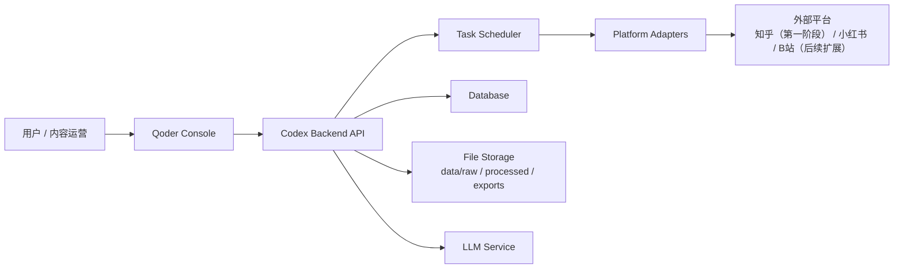
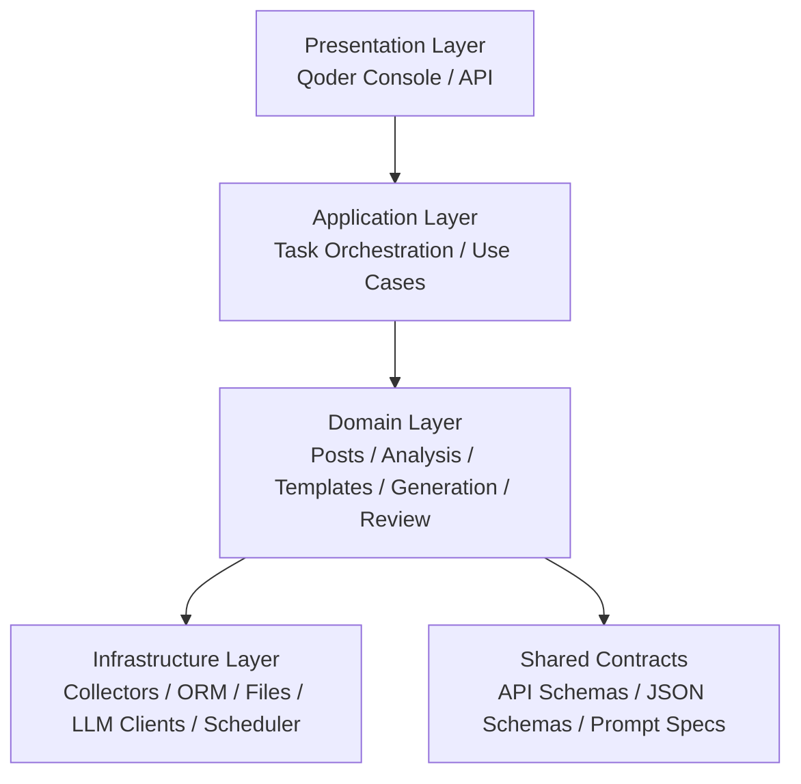
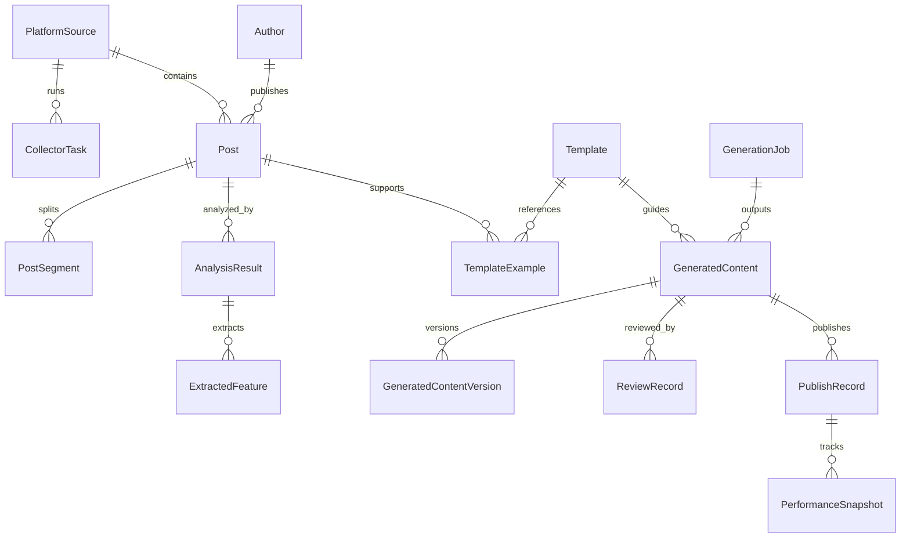
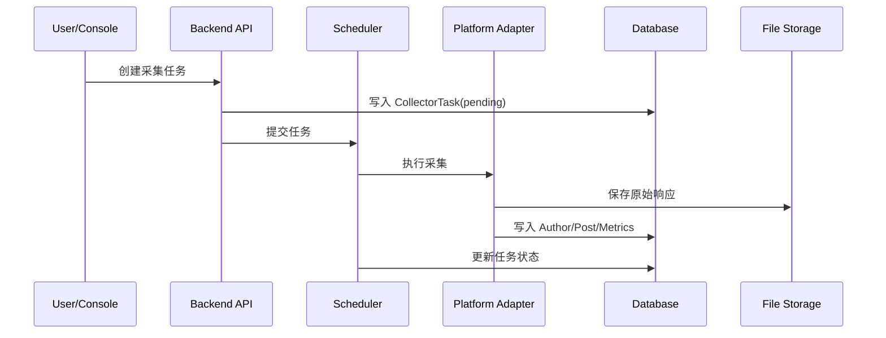
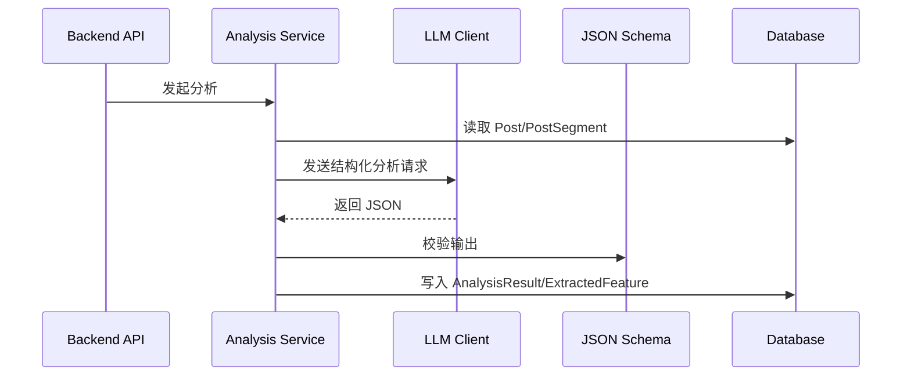
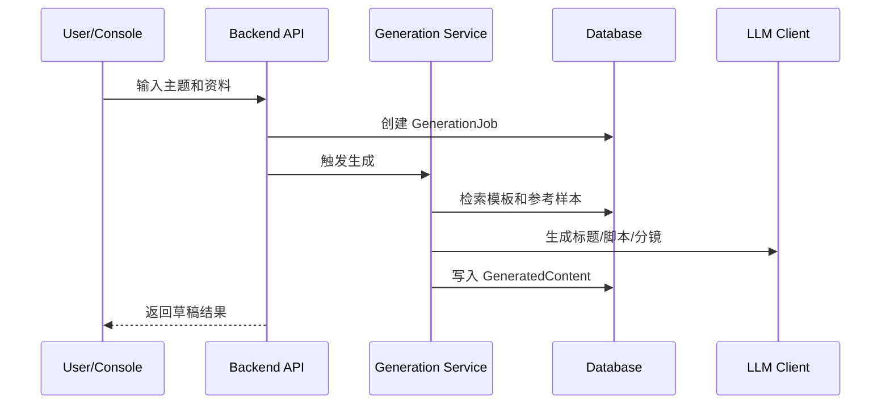
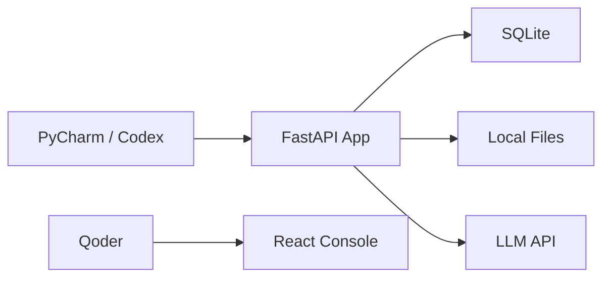
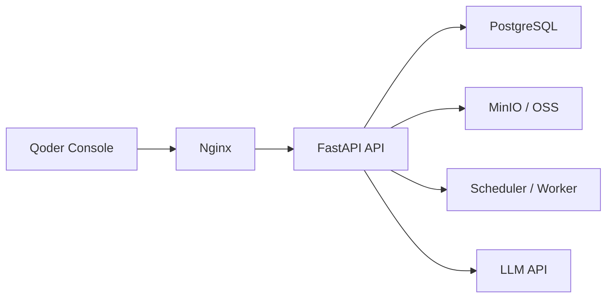
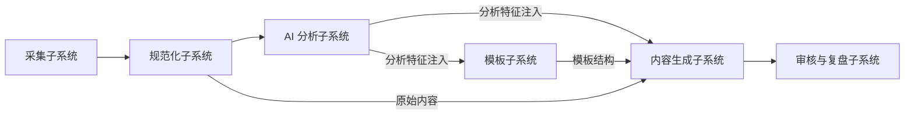

# 架构设计文档

## 1. 文档目的

本文档用于把高层架构细化成可实施的系统设计，重点回答：

1. 系统有哪些核心模块，各自负责什么。
2. 核心流程如何流转，状态如何变化。
3. 哪些对象需要成为后续接口文档和数据字典的核心实体。
4. 本地开发、任务执行、控制台协作如何组织。

## 2. 系统上下文

> 节点具体含义见下方各小节说明。

### 2.1 角色边界

1. `Qoder Console` 负责任务查看、结果查看、模板管理、人工审核、事实确认和发布回填。
2. `Codex Backend API` 负责采集、规范化、AI 分析、模板生成、内容生成。
3. 第一阶段 `Task Scheduler` 默认为可选组件，主流程以手动触发为准。
4. `Platform Adapters` 第一阶段只实现知乎适配器，其他平台仅保留扩展边界。

## 3. 总体分层架构

### 3.1 分层说明

| 层级 | 职责 | 设计要求 |
| --- | --- | --- |
| Presentation | 页面交互、API 暴露、鉴权入口 | 不直接写业务规则 |
| Application | 编排业务流程、驱动任务状态迁移 | 用例清晰，可追踪 |
| Domain | 内容、模板、生成、审核等核心规则 | 避免直接依赖平台实现 |
| Infrastructure | 采集、数据库、文件、模型调用 | 可替换、可独立测试 |
| Shared Contracts | 共享协议、Schema、Prompt 规范 | 后端与控制台共同依赖 |

## 4. 核心子系统设计

### 4.1 采集子系统

职责：

1. 接收采集任务请求。
2. 调用具体平台适配器采集内容。
3. 输出原始内容、作者信息、互动数据和采集日志。

核心模块建议：

1. `app/collectors/base.py`
2. `app/collectors/zhihu/`
3. `app/services/collection_service.py`
4. `app/services/manual_import_service.py`

关键设计：

1. 平台适配器统一输出标准 `CollectedPost` 对象。
2. 通过 `platform_code + platform_post_id` 保证幂等入库。
3. 原始响应和页面快照优先保留，便于字段变更时回放。
4. 手动录入样本与自动采集样本统一落到 `Post` 领域对象。

### 4.2 规范化子系统

职责：

1. 清洗 HTML、Markdown、符号和多余噪声。
2. 标准化标题、正文、标签、发布时间、互动指标。
3. 进行内容分段和去重。

核心模块建议：

1. `app/services/normalization_service.py`
2. `app/services/dedup_service.py`
3. `app/models/post.py`
4. `app/repositories/post_repository.py`

关键设计：

1. 去重以“平台唯一 ID”为第一优先，“内容哈希”为第二优先。
2. 正文分段结果单独存储，便于后续分析长文和视频转写。

### 4.3 AI 分析子系统

职责：

1. 对样本内容进行主题、结构、钩子、情绪、风险分析。
2. 输出结构化分析结果，而不是自由文本结论。
3. 为模板提取和内容生成提供可检索特征。

核心模块建议：

1. `app/analyzers/content_features.py`
2. `app/services/analysis_service.py`
3. `app/core/llm_client.py`
4. `shared/contracts/schemas/analysis-result.schema.json`
5. `app/services/fact_check_service.py`

关键设计：

1. 每次分析必须记录 `model_name`、`prompt_version`、`analysis_version`。
2. 分析请求按 `content_hash + prompt_version + model_name` 做结果缓存。
3. AI 输出必须先经 JSON Schema 校验再入库。
4. 事实风险必须区分 `ai_detected` 与 `human_reviewed` 两类状态。

### 4.4 模板子系统

职责：

1. 基于高表现样本归纳模板。
2. 管理模板的启用、停用、评分和示例绑定。
3. 为生成环节提供可检索模板资产。

核心模块建议：

1. `app/templates/template_engine.py`
2. `app/services/template_service.py`
3. `app/models/template.py`

关键设计：

1. 模板不保存“爆款原句集合”，而保存“结构定义 + 示例映射”。
2. 模板至少包含模板颗粒度、适用赛道、适用平台、适用场景、结构 JSON、质量评分。
3. 模板必须区分草稿态和可用态。

### 4.5 内容生成子系统

职责：

1. 接收主题输入和参考资料。
2. 检索相关样本和模板。
3. 生成标题、脚本、分镜、封面文案、发布文案。

核心模块建议：

1. `app/generators/script_generator.py`
2. `app/services/generation_service.py`
3. `app/models/generated_content.py`
4. `app/services/content_version_service.py`

关键设计：

1. 生成结果必须保留模板和样本来源追踪。
2. 生成过程要区分“任务”和“结果”两类对象，避免一次任务只允许一个输出。
3. 支持同一主题多版本草稿。
4. 审核环节要能返回“原始样本摘要 / AI 初稿 / 当前编辑稿 / 定稿”的对比视图数据。

### 4.6 审核与复盘子系统

职责：

1. 人工审核、编辑、驳回、通过。
2. 记录发布结果和效果指标。
3. 将效果数据回流给模板评分和生成策略。

核心模块建议：

1. `app/services/review_service.py`
2. `app/services/report_service.py`
3. `app/models/review_record.py`
4. `app/services/publish_feedback_service.py`

关键设计：

1. 审核记录与生成结果分离，保留完整审核轨迹。
2. 发布结果单独建模，不直接覆盖生成结果表。
3. 发布数据回填入口必须支持手动录入。

## 5. 目录与模块映射

| 目录 | 责任 |
| --- | --- |
| `apps/codex-backend/app/api` | API 路由、DTO、错误码 |
| `apps/codex-backend/app/collectors` | 平台采集适配器 |
| `apps/codex-backend/app/analyzers` | 内容理解和结构化提取 |
| `apps/codex-backend/app/templates` | 模板提取与模板规则 |
| `apps/codex-backend/app/generators` | 标题、脚本、分镜生成 |
| `apps/codex-backend/app/services` | 用例编排、任务调度、状态流转 |
| `apps/codex-backend/app/models` | ORM 模型与领域对象 |
| `apps/codex-backend/app/repositories` | 数据访问层 |
| `apps/codex-backend/app/core` | 配置、日志、LLM Client、基础能力 |
| `shared/contracts/api` | 接口协议和示例 |
| `shared/contracts/schemas` | JSON Schema、结构化输出约束 |
| `shared/contracts/prompts` | Prompt 模板与版本描述 |

## 6. 核心实体设计

后续接口文档和数据字典建议围绕以下实体展开：

1. `PlatformSource`
2. `CollectorTask`
3. `Author`
4. `Post`
5. `PostSegment`
6. `AnalysisResult`
7. `ExtractedFeature`
8. `Template`
9. `TemplateExample`
10. `GenerationJob`
11. `GeneratedContent`
12. `GeneratedContentVersion`
13. `ReviewRecord`
14. `PublishRecord`
15. `PerformanceSnapshot`
16. `PromptSpec`

### 6.1 核心关系

## 7. 关键状态机设计

### 7.1 `collector_task.status`

建议枚举：

1. `pending`
2. `running`
3. `succeeded`
4. `partial_failed`
5. `failed`
6. `cancelled`

### 7.2 `post.status`

建议枚举：

1. `raw`
2. `normalized`
3. `analyzed`
4. `templated`
5. `archived`

### 7.3 `template.status`

建议枚举：

1. `draft`
2. `active`
3. `disabled`
4. `archived`

### 7.4 `generation_job.status`

建议枚举：

1. `pending`
2. `retrieving`
3. `generating`
4. `reviewing`
5. `completed`
6. `failed`

### 7.5 `generated_content.status`

建议枚举：

1. `draft`
2. `in_review`
3. `approved`
4. `rejected`
5. `published`

### 7.6 `review_record.decision`

建议枚举：

1. `approve`
2. `reject`
3. `edit_required`

## 8. 核心流程时序

### 8.1 内容采集时序

### 8.2 AI 分析时序

### 8.3 内容生成时序

## 9. 存储架构设计

### 9.1 数据库存储

数据库负责保存结构化主数据：

1. 平台、作者、帖子、指标
2. 分析结果和结构特征
3. 模板及模板示例
4. 生成任务和生成结果
5. 审核记录、发布记录、表现快照
6. 模型调用审计日志

### 9.2 文件存储

文件系统负责保存大对象和中间产物：

1. `data/raw/<platform>/<date>/<task_id>/`：原始采集文件
2. `data/processed/analysis/`：分析中间结果和导出 JSON
3. `data/processed/template/`：模板研究报告
4. `data/exports/`：CSV、Markdown、运营导出文件

### 9.3 幂等和唯一性

建议唯一键：

1. `posts(platform_id, platform_post_id)`
2. `authors(platform_id, platform_author_id)`
3. `analysis_results(post_id, analysis_version, prompt_version, model_name)`
4. `templates(name, template_type, applicable_topic, version)`

## 10. 接口域设计基线

为后续接口文档准备，建议按以下资源组织 API：

1. `/platforms`
2. `/collector-tasks`
3. `/posts`
4. `/analysis-results`
5. `/templates`
6. `/generation-jobs`
7. `/generated-contents`
8. `/reviews`
9. `/publish-records`
10. `/reports`

### 10.1 接口设计原则

1. 后端返回统一分页结构。
2. 所有异步任务接口返回 `task_id`。
3. 对 AI 生成和分析接口返回版本信息。
4. 对关键对象返回 `source_trace` 字段，便于前端展示来源。

## 11. 任务执行架构

### 11.1 第一阶段

采用“API + 数据库任务表 + 手动触发”为主，`APScheduler` 仅作为可选能力：

1. API 创建任务。
2. 任务写库。
3. 用户手动执行任务，或在需要时由轻调度器轮询待执行任务。
4. 服务层执行任务并更新状态。

优点：

1. 简单、容易调试。
2. 不依赖 Redis 和独立消息队列。
3. 适合个人开发阶段。

### 11.2 第二阶段可升级

当知乎单平台链路稳定，且第二阶段确实要接入多平台时，再升级到：

1. `FastAPI + Celery + Redis`
2. 独立 Worker
3. 更细粒度的任务重试和并发控制

## 11.3 第一阶段明确不落地

1. 不建设独立 Worker 集群。
2. 不建设统一多平台调度中心。
3. 不建设自动发布流水线。

## 12. 部署架构建议

### 12.1 本地开发

### 12.2 小规模生产

## 13. 日志、审计与观测

第一阶段至少要保留以下日志维度：

1. 采集任务执行日志
2. 平台适配器错误日志
3. AI 请求与响应摘要日志
4. 模板生成和启用日志
5. 审核操作日志

建议每条日志都带：

1. `trace_id`
2. `task_id`
3. `platform_code`
4. `object_id`
5. `status`

## 14. 数据流水线串联设计

### 14.1 流水线全景

### 14.2 子系统间数据流转契约

| 上游 | 下游 | 流转数据 | 连接方式 |
|------|------|---------|----------|
| 采集 → 分析 | Post → AnalysisResult | post_id, title, content_text | 前端 PostDetail 触发分析 |
| 分析 → 模板归纳 | AnalysisResult → Template | analysis_ids, main_topic, narrative_structure, emotional_driver | 前端选择分析结果 → 调用 auto-summarize |
| 分析 → AI 模板生成 | AnalysisResult → Template | reference_post_ids → 查询 Post + Analysis 注入 Prompt | 前端传 reference_post_ids → 后端注入 Prompt |
| 分析 → 内容生成 | AnalysisResult → GeneratedContent | reference_post_ids → 查询 Post + Analysis 注入 Prompt | 后端 generation_service 自动查询分析数据 |
| 模板 → 内容生成 | Template → GeneratedContent | selected_template_id → template.structure_json | 前端选择模板 → 后端读取结构 |

### 14.3 关键设计原则

1. **分析特征是流水线核心资产**：分析产出的 main_topic、hook_text、narrative_structure、emotional_driver 必须被下游（模板和生成）有效消费。
2. **后端自动注入**：当 reference_post_ids 非空时，后端自动查询最新分析结果并注入 Prompt，前端无需额外操作。
3. **前端驱动连接**：流水线各阶段的触发和选择由前端控制台驱动（选择样本、选择模板、触发归纳），后端提供数据服务。
4. **渐进增强**：流水线连接采用可选参数设计，不传参考数据时各子系统独立工作不受影响。

### 14.4 当前实现状态与差距

| 连接点 | 后端 | 前端 | 状态 |
|--------|------|------|------|
| 分析 → 模板归纳 | ✅ auto_summarize 已实现 | ❌ 无 UI 入口 | 需补前端 |
| 样本 → 生成 | ✅ reference_post_ids 参数已支持 | ❌ 无样本选择器 | 需补前端 |
| 模板 → 生成 | ✅ selected_template_id 参数已支持 | ❌ 手动输入 ID | 需补前端 |
| 分析特征 → 生成 Prompt | ❌ 只传 title/content_text | - | 需改后端 |
| 分析特征 → AI 模板 Prompt | ❌ 不注入任何样本数据 | - | 需改后端 |

> 详细修复方案见 `16-frontend-pipeline-fix.md` 和 `17-backend-pipeline-fix.md`。

## 15. 扩展点设计

为避免后续返工，架构上需要提前预留以下扩展点：

1. 新平台适配器接入点
2. 多模型切换能力
3. 模板版本升级机制
4. 批量研究报告导出能力
5. 发布后效果自动回填能力

## 16. 对后续文档的约束

后续写接口文档和数据字典时，建议严格继承以下口径：

1. 以第 6 章核心实体为对象边界。
2. 以第 7 章状态枚举为状态定义来源。
3. 以第 10 章接口域为接口章节结构。
4. 以第 9 章存储分层区分“数据库字段”和“文件资产字段”。

## 17. 结论

本项目第一阶段最适合采用“单体后端 + 插件化采集器 + 结构化 AI 输出 + 轻量控制台”的架构。  
这个架构既能支撑你现在的开发方式，也能自然衔接后续的接口文档、数据字典、任务调度升级和平台扩展。
